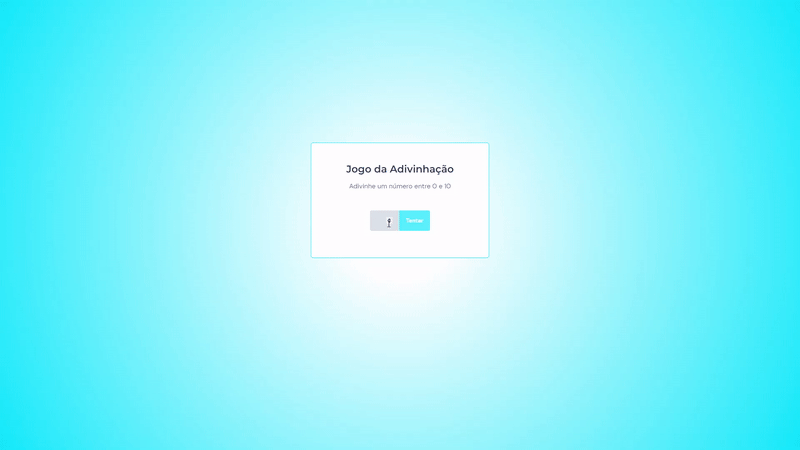

# Jogo da Adivinhação

> Trilha Explorer

Projeto desenvolvido durante o curso Explorer da Rocketseat, ao final do módulo de JavaScript, com o intuito de colocar em prática o conteúdo aprendido.

[Clique aqui para acessar](https://desenvjonathan.github.io/guessing-game/)

## Tecnologias

- HTML
- CSS
- JavaScript
- Git e Github

## Contatos

- E-mail: desenvjonathan@hotmail.com
- LinkedIn: https://www.linkedin.com/in/jonathan-ramos-p/